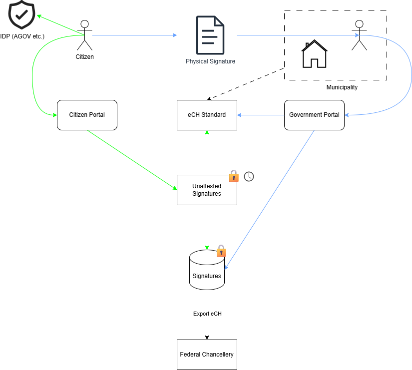
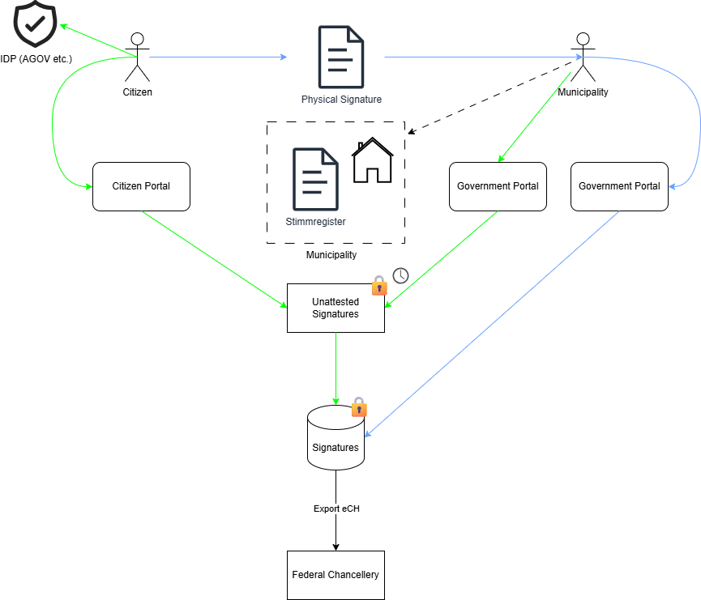
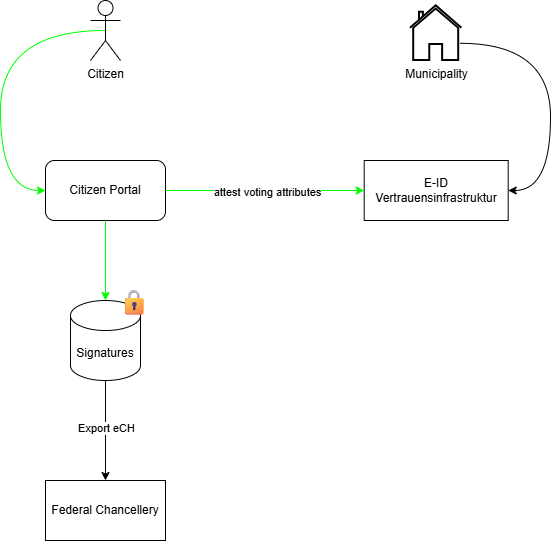

# 7) Von der St.Galler E-Collecting Plattform zur Lösung für eidgenössische Vorlagen

*Over the course of two days, you will develop your solution for collecting electronic signatures for popular initiatives and referendums from A to Z, addressing the 10 topics outlined in the [guidelines](https://www.bk.admin.ch/bk/de/home/politische-rechte/e-collecting/aktuelles.html). Your prototype can be conceptual, clickable, and/or technical. Either way, you should clearly present the interactions and data flows between actors, software, and infrastructure components over time, as well as the user experience of these actors.*

## Approach

Der Kanton St.Gallen hat einen parlamentarischen Auftrag für die Entwicklung von Rechtsgrundlagen und einer E-Collecting-Plattform für Pilotversuche mit kantonalen Initiativen und Referenden.

Die gesetzlichen Grundlagen wurden im September verabschiedet (siehe [IX. Nachtrag zum Gesetz über Referendum und Initiative](https://publikationen.sg.ch/ekab/00.225.426/pdf/)) und sehen für die Pilotphase eine sogenannte Fixanteillösung vor. Das bedeutet, dass in einem ersten Schritt höchstens 50% der benötigten Unterschriften elektronisch gesammelt werden dürfen.

Die Entwicklung der E-Collecting-Plattform wurde öffentlich ausgeschrieben und ihre Umsetzung ist bereits sehr weit fortgeschritten. Der Go-Live ist fürs Frühjahr 2026 geplant.

Vorgängig wird der Quellcode der Plattform im Rahmen eines Bug-Bounty-Programms offengelegt. Das Private Bug Bounty läuft bereits seit Ende August; das Public Bug Bounty folgt.

Die E-Collecting-Plattform wurde so umgesetzt, dass sie alle rechtlichen und politischen Anforderungen im Kanton St.Gallen erfüllt. Dazu gehört unter anderem, dass… 
- Mängel bei den Stimmrechtsbescheinigungen durch die Gemeinden von der Staatskanzlei mittels Stichprobenkontrolle behoben werden müssen (Artikel 26 des Gesetzes über Referenden und Initiativen);
- Mehrfachunterzeichnungen verhindert werden müssen (Fixanteillösung, i.e. 50 Prozent der Unterschriften müssen weiterhin auf herkömmlichem Weg gesammelt werden);
- die Bestimmungen des Datenschutzgesetzes des Kantons St.Gallens erfüllt werden;
- die Gemeinden entlastet werden müssen.

Damit erfüllt die St.Galler Plattform alle Voraussetzungen, um ab dem Frühjahr 2026 erste Erfahrungen mit E-Collecting zu sammeln und die Auswirkungen aufs politische System untersuchen zu können. Auf Basis dieser Erfahrungen kann dann beurteilt werden, ob eine Anpassung von Sammelfristen oder Quoren nötig ist.

Die E-Collecting-Plattform ist so gebaut, dass sie für zukünftige Sammlungen auf Bundesebene weiterentwickelt werden kann. Bereits heute ist es möglich, die Plattform für die Prüfung und Bescheinigung der physischen Unterschriften auf allen föderalen Ebenen zu verwenden.

In den docs finden Sie diverse Dokumente zum St.Galler E-Collecting Projekt.

## Documentation and Diagrams

### Stimmrechtsprüfung mit Stimmregister

### Stimmrechtsprüfung mit eCH-Standard

### Stimmrechtsprüfung manuell

### Konzept Anbindung E-ID

## User Experience

*Add or reference wireframes or mockups with user flow showing the user experience of different actors.*

## Topics addressed

Am Hackathon wollen wir uns mit der Frage auseinandersetzen, **wie das System weiterentwickelt werden kann, so dass es auch Kantonen einen Mehrwert bringt, die (noch) nicht über ein zentrales Stimmregister verfügen**.

Dabei stellen sich Fragen wie:
- Welche Daten müssen ausgetauscht werden und auf welchem Weg?
- Wie viel Zeitverlust zwischen Unterzeichnung und Bescheinigung einer Unterschrift ist akzeptabel?
- Wie muss der Prozess aussehen, damit die Gemeinden dennoch entlastet werden können?

Um Antworten auf diese Fragen zu finden, suchen wir insbesondere Vertreterinnen und Vertreter von Gemeinden und anderen Kantonen, die sich unserem Team anschliessen möchten.

| Topic                                                                                                                                | Umsetzung                                                                                                                                                                                                                                                                            |                                                                                                                                                                                                                  |
| ------------------------------------------------------------------------------------------------------------------------------------ | ------------------------------------------------------------------------------------------------------------------------------------------------------------------------------------------------------------------------------------------------------------------------------------ | -------------------------------------------------------------------------------------------------------------------------------------------------------------------------------------------------------------------------------------- |
| Vom Unterstützungswillen zur Unterstützungsbekundung                                                                                 | - Citizen Portal - Eigene Sammlungen erstellen - Eigene / Fremde Sammlungen mit Unterschrift unterstützen - Eigenen Unterstützungsstatus prüfen - Aktive Trennung Government und Bevölkerung                                                                             |                                                                                                                                                                                                                                        |
| Zugang zu aktuellen Informationen über die eingereichten Unterstützungsbekundungen                                                   | - Aktueller Sammlungsstand für Behörden (elektornisch und physisch) - Aktueller Sammlungsstand für Komitees (nur elektronisch) - Statistikdaten für Behörden                                                                                                                   |                                                                                                                                                                                                                                        |
| Zuschreibung der Unterstützungsbekundungen an Komitees und Sammelunternehmen                                                         | - Sammlungsstatistik pro Komitee pro Geschäft - Mehrere Komitees möglich im Bereich der Referenden - Ursprüngliche Auswertung der Sammelunternehmen der physischen Listen weiterhin möglich (bestehender Prozess)                                                              |                                                                                                                                                                                                                                        |
| Unterbreitung von Argumenten der Komitees via E-Collecting                                                                           | - Personalisierte Seite pro Sammlung - Eigene Grafiken mögich - Pflichtfelder je nach Geschäftstyp (z.B Wortlaut einer Initiative) - Möglichkeit zur Generierung standardisierter Unterschriftenlisten                                                                      |                                                                                                                                                                                                                                        |
| Ausschluss unrechtmässiger Unterstützungsbekundungen                                                                                 | - Durch eine persönliche Identität (AGOV, E-ID) welche eine verifizierte AHVN13 sicherstellt - Erkennung von Mehrfachunterzeichnungen auf elektronischem sowie physischem Kanal                                                                                                   |                                                                                                                                                                                                                                        |
| Verhinderung unterschlagener Unterstützungsbekundungen                                                                               | - Live Prüfung sofern ein zentrales Stimmregister angebunden ist - Zeitverzögerte Bescheinigung bei physischen Unterschriftenlisten oder Kantonen ohne zentrales Stimmregister - Sammelfristen für jede Sammlung korrekt eingestellt                                           | - Ausbau der Stimmrechtsprüfung für Gemeinden in Kantonen ohne zentrales Stimmregister - Halbautomatisierte oder manuelle Prüfung einer elektronischen Unterschrift möglich - Prozessaufbau an physische Bescheinigung angelehnt |
| Wahrung des Stimmgeheimnisses                                                                                                        | - Sicherstellung dass keine Gesinnungsdatenbank gebildet werden kann durch kryptografische Verfahren - Einbinden mehrerer Parteien in das Schlüsselmanagement (Backupverfahren) - Zentrales löschen der Kontrollzeichen elektronischer und physischer Unterschriften           |                                                                                                                                                                                                                                        |
| Integration mit dem papierbasierten Prozess                                                                                          | - Komplette Integration des bestehenden Prozesses - Improvements im Bereich Duplikaterkennung bis auf kantonale Ebene - Elektronische und physische Bekundungen in der selben Plattform verwalten                                                                              |                                                                                                                                                                                                                                        |
| Erleichterte Einführung für Gemeinden mit Effizienzgewinn; auf der Grundlage von bestehender Infrastruktur und bestehenden Prozessen | - Bestehende Prozesse bleiben bestehen (inkl. Stichprobenkontrolle) - Bescheinigung der elektronischen Unterschriften analog der physischen  (sofern kein zentrales Stimmregister vorhanden)                                                                                      |                                                                                                                                                                                                                                        |
| E-Collecting für alle föderalen Ebenen                                                                                               | - Sämtliche Ebenen sind weiterhin durch den bestehenden physischen Prozess abgebildet - E-Collecting auf kantonaler Ebene inkludiert - E-Collecting auf kommunaler Ebene vorbereitet (Entscheid SG ausstehend) - Erweiterung E-Collecting auf eidgenössischer Ebene möglich | - Einlieferung der Resultate (ohne Unterschriften) an die BK - Stichprobenfenster pro Kanton für die BK möglich um gezielte Kontrollen vorzunehmen                                                                                  |

## Key Strenghts and Weaknesses

*List the key strengths and weaknesses of your solution.*

### Strengths:
- ...
- ...

### Weaknesses:
- ...
- ...

## Getting Started

*These instructions will get you a copy of the technical prototype (if applicable) up and running on your local machine for development and testing purposes. **If you are not developing a technical prototype, please present or reference your conceptual and/or clickable prototype.***

### Prerequisites

*What things you need to install the software and how to install them.*

### Installation

*A step by step series of examples that tell you how to get a development env running.*

## Contributing

Please read [CONTRIBUTING.md](/CONTRIBUTING.md) for details on our code of conduct.

## Team Members

- Sebastian Fust (Staatskanzlei St.Gallen)
- Denis Morel (Mabuco)
- Darius Bohni (442 Security)
- Johannes Schuster (Solution Architect Solution Design; Abraxas)
- Mario Odenbach (ICT-Architekt Solution Design; Abraxas)
- Fabian Geiger (Software-Ingenieur .Net Development; Abraxas)
- Moritz Zaugg (Kanton Bern)
- Marietta den Otter (Kanton Solothurn)

## License

This software is licensed under a AGPL 3.0 License - see the [LICENSE](LICENSE) file for details. Please feel free to [choose any other](https://choosealicense.com/) [Open Source Initiative approved license](https://opensource.org/licenses) (e.g. a permissive license such as [MIT](https://opensource.org/license/mit)). Other content (e.g. text, images, etc.) is licensed under a [Creative Commons CC BY-SA 4.0 license](https://creativecommons.org/licenses/by-sa/4.0/deed.de). Exceptions are possible in consultation with the organizers.
# 7) Von der St.Galler E-Collecting Plattform zur Lösung für eidgenössische Vorlagen

*Over the course of two days, you will develop your solution for collecting electronic signatures for popular initiatives and referendums from A to Z, addressing the 10 topics outlined in the [guidelines](https://www.bk.admin.ch/bk/de/home/politische-rechte/e-collecting/aktuelles.html). Your prototype can be conceptual, clickable, and/or technical. Either way, you should clearly present the interactions and data flows between actors, software, and infrastructure components over time, as well as the user experience of these actors.*

## Approach

Der Kanton St.Gallen hat einen parlamentarischen Auftrag für die Entwicklung von Rechtsgrundlagen und einer E-Collecting-Plattform für Pilotversuche mit kantonalen Initiativen und Referenden.

Die gesetzlichen Grundlagen wurden im September verabschiedet (siehe [IX. Nachtrag zum Gesetz über Referendum und Initiative](https://publikationen.sg.ch/ekab/00.225.426/pdf/)) und sehen für die Pilotphase eine sogenannte Fixanteillösung vor. Das bedeutet, dass in einem ersten Schritt höchstens 50% der benötigten Unterschriften elektronisch gesammelt werden dürfen.

Die Entwicklung der E-Collecting-Plattform wurde öffentlich ausgeschrieben und ihre Umsetzung ist bereits sehr weit fortgeschritten. Der Go-Live ist fürs Frühjahr 2026 geplant.

Vorgängig wird der Quellcode der Plattform im Rahmen eines Bug-Bounty-Programms offengelegt. Das Private Bug Bounty läuft bereits seit Ende August; das Public Bug Bounty folgt.

Die E-Collecting-Plattform wurde so umgesetzt, dass sie alle rechtlichen und politischen Anforderungen im Kanton St.Gallen erfüllt. Dazu gehört unter anderem, dass… 
- Mängel bei den Stimmrechtsbescheinigungen durch die Gemeinden von der Staatskanzlei mittels Stichprobenkontrolle behoben werden müssen (Artikel 26 des Gesetzes über Referenden und Initiativen);
- Mehrfachunterzeichnungen verhindert werden müssen (Fixanteillösung, i.e. 50 Prozent der Unterschriften müssen weiterhin auf herkömmlichem Weg gesammelt werden);
- die Bestimmungen des Datenschutzgesetzes des Kantons St.Gallens erfüllt werden;
- die Gemeinden entlastet werden müssen.

Damit erfüllt die St.Galler Plattform alle Voraussetzungen, um ab dem Frühjahr 2026 erste Erfahrungen mit E-Collecting zu sammeln und die Auswirkungen aufs politische System untersuchen zu können. Auf Basis dieser Erfahrungen kann dann beurteilt werden, ob eine Anpassung von Sammelfristen oder Quoren nötig ist.

Die E-Collecting-Plattform ist so gebaut, dass sie für zukünftige Sammlungen auf Bundesebene weiterentwickelt werden kann. Bereits heute ist es möglich, die Plattform für die Prüfung und Bescheinigung der physischen Unterschriften auf allen föderalen Ebenen zu verwenden.

In den docs finden Sie diverse Dokumente zum St.Galler E-Collecting Projekt.

## Documentation and Diagrams

### Stimmrechtsprüfung mit Stimmregister

### Stimmrechtsprüfung mit eCH-Standard

### Stimmrechtsprüfung manuell

### Konzept Anbindung E-ID

## User Experience

*Add or reference wireframes or mockups with user flow showing the user experience of different actors.*

## Topics addressed

Am Hackathon wollen wir uns mit der Frage auseinandersetzen, **wie das System weiterentwickelt werden kann, so dass es auch Kantonen einen Mehrwert bringt, die (noch) nicht über ein zentrales Stimmregister verfügen**.

Dabei stellen sich Fragen wie:
- Welche Daten müssen ausgetauscht werden und auf welchem Weg?
- Wie viel Zeitverlust zwischen Unterzeichnung und Bescheinigung einer Unterschrift ist akzeptabel?
- Wie muss der Prozess aussehen, damit die Gemeinden dennoch entlastet werden können?

Um Antworten auf diese Fragen zu finden, suchen wir insbesondere Vertreterinnen und Vertreter von Gemeinden und anderen Kantonen, die sich unserem Team anschliessen möchten.

| Topic                                                                                                                                | Umsetzung                                                                                                                                                                                                                                                                                                                                                                                                                                                                                          |
| ------------------------------------------------------------------------------------------------------------------------------------ | ------------------------------------------------------------------------------------------------------------------------------------------------------------------------------------------------------------------------------------------------------------------------------------ | -------------------------------------------------------------------------------------------------------------------------------------------------------------------------------------------------------------------------------------- |
| Vom Unterstützungswillen zur Unterstützungsbekundung                                                                                 | Die Stimmbürgerinnen und Stimmbürger können zu jeder Zeit und ortsunabhängig in ihrem Browser das Citizen-Portal der St.Galler E-Collecting-Plattform aufrufen. Die Authentizität dieses Portals kann durch die Prüfung des Fingerprints mittels SSL-Zertifikats gewährleistet werden. Das Zertifikat wird auf der Webseite des Kantons publiziert. Im Portal sind alle laufenden Sammlungen (Initiativen und Referenden) aufgelistet und es können auch eigene Sammlungen eingerichtet werden. Die laufenden Sammlungen werden absteigend nach der verbleibenden Zeit bis zum Ende der Sammelfrist sortiert (d.h. die Sammlungen deren Frist als nächstes abläuft, werden zuoberst angezeigt). Mehrere zeitgleich laufende Sammlungen gegen den gleichen referendumsfähigen Erlass werden nach dem Zeitpunkt der Einrichtung sortiert (d.h. je früher eingerichtet, desto weiter oben erscheint die Sammlung). Durch diese objektiven Kriterien der Sortierung wird die politische Neutralität gewährleistet.    Nachdem eine Stimmbürgerin oder ein Stimmbürger eine bestimmte Sammlung angeklickt hat, gelangt sie auf deren Detailseite. Auf dieser Seite finden die Stimmbürgerinnen und Stimmbürger alle relevanten Informationen zur Sammlung (Titel des referendumsfähigen Erlasses, Initiativ- resp. Referendumstext, allfällige Begründungen, Mitgliederliste des Komitees, weiterführende Links, etc.) sowie die rechtlichen Bestimmungen. Mittels Klick auf den Button «Unterzeichnen» kann die Sammlung unterstützt werden. Die Stimmberechtigung der unterzeichnenden Person wird dabei automatisiert gegen das zentrale Stimmregister geprüft. Gleichzeitig wird mittels Abgleich der in der E-Collecting-Plattform gesetzten Kontrollzeichen (siehe Antwort auf Topic 5) geprüft, ob die Person die Sammlung bereits unterzeichnet hat (elektronisch oder physisch). Somit erhalten die Unterstützerinnen und Unterstützer in Echtzeit eine Rückmeldung, ob ihre Unterstützungsbekundung korrekt eingegangen ist.   Das Citizen-Portal der E-Collecting-Plattformerfüllt die Kriterien auf Konformitätsstufe AA der WCAG 2.1 gemäss eCH-0059 für Webapplikationen und ist somit barrierefrei bedienbar.                                                                      |                                                                                                                                                                                                                                        |
| Zugang zu aktuellen Informationen über die eingereichten Unterstützungsbekundungen                                                   | Da die von den Gemeinden beglaubigten Unterschriftenlisten wie bis anhin den Komitees zugestellt werden, haben sie stets die Übersicht über den aktuellen Stand der physischen Unterschriften ("analoger Prozess"). Die aktuelle Zahl der elektronisch gesammelten Unterschriften ist jederzeit auf der E-Collecting-Plattform öffentlich einsehbar. Die Komitees haben nach der Einreichung der physischen Unterschriften bei der Oberbehörde zudem die Möglichkeit, eine statistische Auswertung zu generieren, aus der hervorgeht, wie viele elektronische Unterschriften in jeder Gemeinde gesammelt wurden.   Nach Ablauf der Sammelfrist wird im Kanton St.Gallen im Zuge der Feststellung des Zustandekommens resp. Nicht-Zustandekommens der Initiative oder des Referendums ein Protokoll veröffentlicht, in dem die Anzahl physisch gültiger, physisch ungültiger und elektronisch gültiger Unterschriften nach Gemeinde (und Wahlkreis) ausgewiesen wird.   Da es keine ungültigen elektronischen Unterschriften geben kann und die physischen Unterschriftenlisten von den Gemeinden weiterhin den Komitees ausgehändigt werden, haben letztere stets Kenntnis über die Ungültigkeitsgründe.   Mit dem St.Galler System haben die Komitees zu keinem Zeitpunkt Einsicht in die persönlichen Daten (Name, E-Mail-Adresse, Adresse, Geburtsdatum, o.ä) der Personen, die eine elektronische Unterschrift abgegeben haben. Damit wird das Stimmgeheimnis im Vergleich zur aktuellen Praxis deutlich besser geschützt.                                                                                                                   |                                                                                                                                                                                                                                        |
| Zuschreibung der Unterstützungsbekundungen an Komitees und Sammelunternehmen                                                         | Auf der E-Collecting-Plattform des Kantons St.Gallen können zu einem referendumsfähigen Erlass mehrere Sammlungen eingerichtet werden (die Reihenfolge der Publikation der Sammlungen wird in Topic 1 erläutert). Dabei werden die elektronischen Unterschriften auf der Sammlungsebene zugeordnet. Dadurch können die einzelnen Komitees nachvollziehen, welche Sammlung wie viele elektronische Unterschriften beigetragen hat. Beim analogen Prozess ändert sich diesbezüglich nichts, d.h. die Gemeinden stellen die bescheinigten Unterschriftenlisten auch weiterhin den entsprechenden Komitees zu.                                                        |                                                                                                                                                                                                                                        |
| Unterbreitung von Argumenten der Komitees via E-Collecting                                                                           | Die folgenden Informationen müssen von den Sammlungsverwaltern beim Einrichten einer Sammlung auf der E-Collecting-Plattform aufgrund der gesetzlichen Bestimmungen zwingend erfasst resp. ausgewählt werden:   Referendum: --> Erlass, gegen den sich das Referendum richtet --> Bezeichnung des Referendums --> Adresse des Komitees  Initiative: --> Art der Initiative (Verfassungs-, Gesetzes- oder Einheitsinitiative) --> Bezeichnung der Initiative --> Initiativtext --> Adresse des Komitees --> Mitgliederliste des Komitees  Neben diesen Pflichtangaben können optional weitere Angaben wie z.B. eine allfällige Begründung oder einen Link auf eine Webseite hinterlegt werden.  Zusätzlich kann die für den analogen Prozess gestaltete Unterschriftenliste auf die Plattform hochgeladen werden. Sie wird auf der Detailansicht der Sammlung angezeigt und kann von den Stimmbürgerinnen und Stimmbürger heruntergeladen werden. So können sie eine Sammlung weiterhin mit ihrer physischen Unterschrift unterstützen, falls die maximal erlaubte Anzahl elektronischer Unterschriften bereits erreicht ist (Regelung im Kanton St.Gallen, dass maximal 50% des Quorums elektronisch erreicht werden darf). Zudem kann vom System eine standardisierte Unterschriftenliste generiert werden lassen. Darauf sind alle vorabgefüllten Informationen (Pflichtangaben sowie allfällige optionale Infos) sowie die geltenden rechtlichen Bestimmungen automatisch aufgeführt. Zur Gestaltung der Unterschriftenliste kann optional ein Bild sowie ein Logo hochgeladen werden.  Die E-Collecting-Plattform bietet den Komitees die Möglichkeit, Sammlungen vor der Aufschaltung informell prüfen zu lassen. Im Falle von Initiativen findet zudem eine obligatorische Zulässigkeitsprüfung durch die Regierung statt, welche sicherstellt, dass die gesetzlichen Vorgaben an ein Initiativbegehren eingehalten werden (z.B. Eindeutigkeit und Einheitlichkeit, Anzahl Mitglieder im Komitee, etc.). Diese Prüfung kann via E-Collecting-Plattform angefordert werden und ist somit für die Komites medienbruchfrei möglich. Auch hat die zuständige Behörde jederzeit die Möglichkeit, durch das Komitee hochgeladene Dateien zu löschen, falls diese rechtswidrige Inhalte enthalten.  Es ist wichtig anzumerken, dass über eine staatliche Plattform keine unsachlichen Argumente verbreitet werden sollen. Mit der E-Collecting-Plattform des Kantons St.Gallen kann gewährleistet werden, dass die publizierten Informationen formell korrekt sind. Die Stimmbürgerinnen und Stimmbürger werden damit nicht mit falschen Aussagen konfrontiert, was ein Mehrwert im Vergleich zur aktuellen Praxis des Unterschriftensammelns auf der Strasse darstellt.                                                                 |                                                                                                                                                                                                                                        |
| Ausschluss unrechtmässiger Unterstützungsbekundungen                                                                                 | Bei der Abgabe der elektronischen Unterschrift wird eine persönliche, elektronische Identität (AGOV, E-ID), welche durch die verifizierte AHVN13 sichergestellt wird, gegen das zentrale Stimmregister abgeglichen. Danach wird auf der E-Collecting-Plattform die verschlüsselte Stimmregister-ID der unterzeichnenden Person gespeichert. Dadurch kann sichergestellt werden, dass niemand für eine andere Person oder ohne die notwendige Stimmberechtigung unterzeichnen kann.  Ab dem Zeitpunkt, zu dem eine Person eine Sammlung elektronisch unterzeichnet hat, ist es für die Gemeinde nicht mehr möglich, für die gleiche Person ein Kontrollzeichen für eine möglicherweise physisch geleistete (zweite) Unterschrift für die betreffende Sammlung zu setzen. Umgekehrt verhindert das System die Abgabe einer elektronischen Unterschrift, sobald die Gemeinde das Kontrollzeichen für die physisch geleistete Unterschrift für die betreffende Sammlung gesetzt hat.  Damit Mehrfachunterzeichnungen ausgeschlossen werden können, müssen die Gemeinden die Kontrollzeichen für die physischen Unterschriften auf der E-Collecting-Plattform pflegen. Die E-Collecting-Plattform des Kantons St.Gallen ist so gebaut, dass sie für die Prüfung und Bescheinigung der physischen Unterschriften für Sammlungen aller föderalen Ebenen verwendet werden kann. Zudem kann dadurch verhindert werden, dass eine Person durch einen Umzug innerhalb des Kantons während einer laufenden Sammelfrist eine Sammlung zweimal unterzeichnen kann. Mit der aktuellen Praxis kann dies nicht ausgeschlossen werden.  Auch können aus dem St.Galler System Beweismittel generiert werden, welche als Grundlage für eine allfällige gerichtliche Überprüfung eingebracht werden können. Es wird ein Audit-Log geführt, welches sämtliche schreibenden Operationen auf kritischen Tabellen in der Datenbank festhält. Zusätzlich werden Datensätze mit einer Integritätssignatur versehen, um die Authentizität von Daten sicherstellen zu können. Die Audit-Logs einer Sammlung werden zusammen mit den Daten derselben Sammlung gebackuped. Nach dem Erwahrungsentscheid durch die Oberbehörde werden die Audit-Logs zusammen mit den Daten der Sammlung unwiderruflich gelöscht.                                                                                           |                                                                                                                                                                                                                                        |
| Verhinderung unterschlagener Unterstützungsbekundungen                                                                               | Durch die Anbindung der E-Collecting-Plattform ans zentrale Stimmregister kann eine Überprüfung der Stimmberechtigung in Echtzeit und ohne manuellen Prozess vorgenommen werden. Die Anzahl der abgegebenen elektronischen Unterschriften ist auf der Plattform jederzeit öffentlich einsehbar.  In Kantonen ohne zentralem Stimmregister kann die Bescheinigung der Stimmberechtigung nur zeitverzögert vorgenommen werden. Das Team St.Gallen hat im Rahmen des Hackathons Lösungsansätze entwickelt, wie das St.Galler E-Collecting-System auch in Kantonen ohne zentrales Stimmregister eingesetzt werden könnte (siehe draw.io Diagramme). Dabei sollen, wo immer möglich, bestehende eCH-Standards verwendet werden und die Gemeinden sind dadurch weiterhin befähigt, Mehrfachunterzeichnungen zu verhindern. Anstelle der verschlüsselten Register-ID kann dabei entweder die Quellsystem-ID oder die AHVN13 verwendet werden. Letztere bietet dabei weiterhin den Schutz vor Mehrfachunterzeichnungen bei einem Umzug innerhalb eines Kantons.                                                                                                                                                                                                                                       
|Wahrung des Stimmgeheimnisses                                                                                                        | Es ist davon auszugehen, dass der analoge, papierbasierte Prozess noch für viele Jahre bestehen bleiben wird. Somit muss ein E-Collecting-System die Verhinderung von Mehrfachunterzeichnung auch über die beiden Kanäle hinweg gewährleisten. Um dies sicherzustellen, sehen wir im Moment keine andere Lösung, als dass eine Gemeinde im Moment der Bescheinigung einer physischen Unterschrift weiss, ob die betreffende Person eine Sammlung bereits physisch oder elektronisch unterzeichnet hat. Im Kanton St.Gallen besteht zudem der gesetzliche Auftrag, dass die Staatskanzlei bei kantonalen Initiativen und Referenden mittels Stichprobenprüfung allfällige Mängel der von den Gemeinden ausgestellten Stimmrechtsbescheinigungen auf den eingereichten Unterschriftenlisten behebt (Art. 26 Abs. 1 des Gesetzes über Referendum und Initiative [sGS 125.1]). Somit muss auch die Staatskanzlei nach der Einreichung der physischen Unterschriftenlisten davon Kenntnis haben, wer eine Sammlung unterzeichnet hat. Fehlt der gesetzliche Auftrag für eine derartige Stichprobenprüfung (wie etwa auf Ebene Bund), haben nur die Gemeinden Kenntnis davon, wer eine Sammlung physisch oder elektronisch unterzeichnet hat. Damit ist die E-Collecting-Plattform so dezentral wie möglich aufgebaut und berücksichtigt das Stimmgeheimnis und den Datenschutz soweit es die Gesetzgebung zulässt. Wichtig ist festzuhalten, dass aus dem System zu keinem Zeitpunkt eine Liste aller abgegebenen Unterschriften generiert werden kann und die Kontrollzeichen für die Stichprobenprüfung nur auf Personenebene geprüft werden können.  Die Kontrollzeichen für Sammlungen auf eidgenössischer und kantonaler Ebene werden nach dem Erwahrungsentscheid zudem zukünftig zentral durch die Staatskanzlei gelöscht. Dies entlastet die Gemeinden und stellt sicher, dass die Kontrollzeichen über die gesamte Sammlung auch tatsächlich gelöscht werden. Nach der Löschung der Kontrollzeichen wird auch die verschlüsselte Stimmregister-ID unwiderruflich gelöscht, was Rückschlüsse auf eine Person verunmöglicht. Bei der Löschung werden ebenfalls die kryptografischen Schlüssel gelöscht, was es unmöglich macht, die Stimmregister-IDs aus einem Datenbank-Backup heraus wiederherzustellen. Die Wiederherstellung eines Datenbank-Standes ist zusätzlich durch den Kanton kryptografisch geschützt, so dass der Betreiber der E-Collecting-Plattform nicht eigenständig einen Restore durchführen kann.  Rückschlüsse auf eine Person ohne Zugriff auf das Stimmregister, die E-Collecting-Plattform sowie auf den Schlüssel für die betreffende Sammlung sind zu keinem Zeitpunkt möglich. Das temporäre Speichern der verschlüsselten ID ist nötig, um Mehrfachunterzeichnung zu verhindern und die Stichprobenkontrolle im analogen Prozess sicherzustellen.  Die unwiderrufliche Löschung der Daten stellt gegenüber einer auf der Blockchain-Technologie basierenden Lösung einen grossen Vorteil dar. Blockchain-Technologie setzt auf die unveränderliche und permanente Natur von Daten, jedoch ist es aktuell unmöglich, eine Aussage zu tätigen, wie diese somit weiterexistierenden Daten auch in einigen Jahrzehnten gesichert und geschützt werden können.                                                                          |                                                                                                                                                                                                                                        |
| Integration mit dem papierbasierten Prozess                                                                                                                                                                                                                               | Der analoge Prozess wurde komplett in die St.Galler E-Collecting-Plattform integriert. So können die Gemeinden die Kontrollzeichen für physische Unterschriften von Sammlungen auf allen drei föderalen Ebenen auf der Plattform pflegen. Sobald jedoch auf einer Ebene E-Collecting angeboten wird, müssen die Gemeinden zwecks Verhinderung von Mehrfachunterzeichnung die Kontrollzeichen für physische Unterschriften zwingend auf der Plattform pflegen.  Abgesehen davon, dass die Gemeinden die Kontrollzeichen in Zukunft auf der E-Collecting-Plattform pflegen müssen, ändert sich für sie nichts am Prozess. Durch die automatisierte Überprüfung der Stimmberechtigung und die Verhinderung von Mehrfachunterzeichnungen durch das E-Collecting-System werden sie jedoch stark entlastet.  Komitees können auf der E-Collecting-Plattform die Sammlungen nicht nur für die elektronische Unterschriftensammlung einrichten. Über die Plattform können die Komitees auch alle Prozessschritte, die vor dem Start der Sammelfrist anfallen (Gestaltung einer Unterschriftenliste, informelle Vorprüfungen, Zulässigkeitsprüfung bei Initiativen, etc.), medienbruchfrei durchführen.
| Erleichterte Einführung für Gemeinden mit Effizienzgewinn; auf der Grundlage von bestehender Infrastruktur und bestehenden Prozessen | Die automatisierte Überprüfung der Stimmberechtigung bei elektronischen Unterschriften (siehe Topic 1) stellt eine enorme Entlastung für die Gemeinden dar. Mit den vom Team St.Gallen am Hackathon entwickelten Lösungen würden für die Gemeinden in Kantonen ohne zentrales Stimmregister keine Mehraufwände entstehen (verglichen mit dem heutigen, rein analogen Prozess). Und für den Fall, dass zu einem späteren Zeitpunkt ein zentrales Stimmregister eingeführt werden sollte, würden sie bei deren Anbindung an die E-Collecting-Plattform in vollem Umfang von der Entlastung profitieren.                                                                                    |                                                                                                                                                                                                                                        |
| E-Collecting für alle föderalen Ebenen                                                                                               | Die St.Galler E-Collecting-Plattform wurde für kantonale und kommunale Initiativen und Referenden entwickelt. Dazu werden die Gemeinden auf der Plattform auch die Kontrollzeichnen für die eidgenössischen Initiativen und Referenden erfassen. Dies bringt einen Mehrwert gegenüber dem heutigen Stand, weil Mehrfachunterzeichnungen über den gesamten Kanton geprüft werden können und nicht nur innerhalb der Gemeinden. Dies reduziert wiederum den Aufwand für die Bereinigung durch die Bundeskanzlei.  Bei der Entwicklung der Plattform wurde bereits berücksichtigt, dass sie für zukünftige Sammlungen auf Bundesebene weiterentwickelt werden kann. Zudem wurden im Rahmen des Hackathons Lösungen entwickelt, so dass die St.Galler E-Collecting-Plattform auch für Kantone ohne zentrales Stimmregister einen Mehrwert bringt.  Die Lösung erlaubt eine dezentrale Datenhaltung in den Kantonen. Da auf Bundesebene kein gesetzlicher Auftrag für die Überprüfung von Stichproben der physischen Unterschriften besteht, können die Daten mit der St.Galler Lösung dezentral bei den Kantonen gespeichert werden. Für den Einsatz der Plattform auf Bundesebene sind mehrere Möglichkeiten denk- und umsetzbar. Den Mitarbeiterinnen und Mitarbeitern der Bundeskanzlei könnte ein Zugang auf die Plattform eingerichtet werden, um die aktuellen Zahlen zu den Sammlungen abzufragen. Auch wäre es möglich, der Bundeskanzlei mittels einer standardisierten Schnittstelle die Anzahl bescheinigter (physischer und elektronischer) Unterschriften zu übermitteln. Der Transfer müsste dabei signiert werden, so dass allfällige Angriffe mit dem Ziel, Daten zu verändern, aufgedeckt würden.  Die Lösung, die das Team St.Gallen während des Hackathons entwickelt hat, erlaubt die Nutzung des St.Galler Systems auch in Kantonen, welche nicht über ein zentrales Stimmregister verfügen. Dies bedeutet, dass mit der St.Galler E-Collecting-Plattform alle Fälle abgedeckt werden und das System in jedem Kanton eingesetzt werden könnte.                                                                                 |

## Key Strenghts and Weaknesses

*List the key strengths and weaknesses of your solution.*

### Strengths:
- ...
- ...

### Weaknesses:
- ...
- ...

## Getting Started

*These instructions will get you a copy of the technical prototype (if applicable) up and running on your local machine for development and testing purposes. **If you are not developing a technical prototype, please present or reference your conceptual and/or clickable prototype.***

### Prerequisites

*What things you need to install the software and how to install them.*

### Installation

*A step by step series of examples that tell you how to get a development env running.*

## Contributing

Please read [CONTRIBUTING.md](/CONTRIBUTING.md) for details on our code of conduct.

## Team Members

- Sebastian Fust (Staatskanzlei St.Gallen)
- Denis Morel (Mabuco)
- Darius Bohni (442 Security)
- Johannes Schuster (Solution Architect Solution Design; Abraxas)
- Mario Odenbach (ICT-Architekt Solution Design; Abraxas)
- Fabian Geiger (Software-Ingenieur .Net Development; Abraxas)
- Moritz Zaugg (Kanton Bern)
- Marietta den Otter (Kanton Solothurn)

## License

This software is licensed under a AGPL 3.0 License - see the [LICENSE](LICENSE) file for details. Please feel free to [choose any other](https://choosealicense.com/) [Open Source Initiative approved license](https://opensource.org/licenses) (e.g. a permissive license such as [MIT](https://opensource.org/license/mit)). Other content (e.g. text, images, etc.) is licensed under a [Creative Commons CC BY-SA 4.0 license](https://creativecommons.org/licenses/by-sa/4.0/deed.de). Exceptions are possible in consultation with the organizers.
