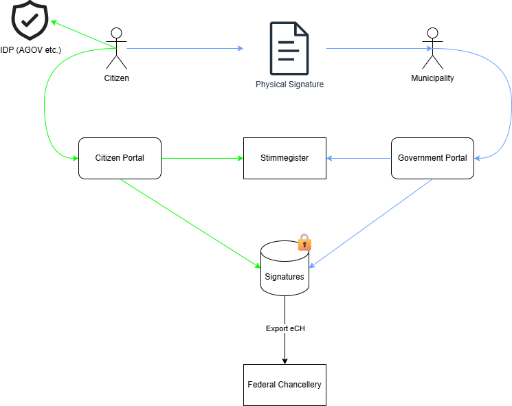

# 7) Von der St.Galler E-Collecting Plattform zur Lösung für eidgenössische Vorlagen

*Over the course of two days, you will develop your solution for collecting electronic signatures for popular initiatives and referendums from A to Z, addressing the 10 topics outlined in the [guidelines](https://www.bk.admin.ch/bk/de/home/politische-rechte/e-collecting/aktuelles.html). Your prototype can be conceptual, clickable, and/or technical. Either way, you should clearly present the interactions and data flows between actors, software, and infrastructure components over time, as well as the user experience of these actors.*

## Approach

Der Kanton St.Gallen hat einen parlamentarischen Auftrag für die Entwicklung von Rechtsgrundlagen und einer E-Collecting-Plattform für Pilotversuche mit kantonalen Initiativen und Referenden.

Die gesetzlichen Grundlagen wurden im September verabschiedet (siehe [IX. Nachtrag zum Gesetz über Referendum und Initiative](https://publikationen.sg.ch/ekab/00.225.426/pdf/)) und sehen für die Pilotphase eine sogenannte Fixanteillösung vor. Das bedeutet, dass in einem ersten Schritt höchstens 50% der benötigten Unterschriften elektronisch gesammelt werden dürfen.

Die Entwicklung der E-Collecting-Plattform wurde öffentlich ausgeschrieben und ihre Umsetzung ist bereits sehr weit fortgeschritten. Der Go-Live ist fürs Frühjahr 2026 geplant.

Vorgängig wird der Quellcode der Plattform im Rahmen eines Bug-Bounty-Programms offengelegt. Das Private Bug Bounty läuft bereits seit Ende August; das Public Bug Bounty folgt.

Die E-Collecting-Plattform wurde so umgesetzt, dass sie alle rechtlichen und politischen Anforderungen im Kanton St.Gallen erfüllt. Dazu gehört unter anderem, dass… 
- Mängel bei den Stimmrechtsbescheinigungen durch die Gemeinden von der Staatskanzlei mittels Stichprobenkontrolle behoben werden müssen (Artikel 26 des Gesetzes über Referenden und Initiativen);
- Mehrfachunterzeichnungen verhindert werden müssen (Fixanteillösung, i.e. 50 Prozent der Unterschriften müssen weiterhin auf herkömmlichem Weg gesammelt werden);
- die Bestimmungen des Datenschutzgesetzes des Kantons St.Gallens erfüllt werden;
- die Gemeinden entlastet werden müssen.

Damit erfüllt die St.Galler Plattform alle Voraussetzungen, um ab dem Frühjahr 2026 erste Erfahrungen mit E-Collecting zu sammeln und die Auswirkungen aufs politische System untersuchen zu können. Auf Basis dieser Erfahrungen kann dann beurteilt werden, ob eine Anpassung von Sammelfristen oder Quoren nötig ist.

Die E-Collecting-Plattform ist so gebaut, dass sie für zukünftige Sammlungen auf Bundesebene weiterentwickelt werden kann. Bereits heute ist es möglich, die Plattform für die Prüfung und Bescheinigung der physischen Unterschriften auf allen föderalen Ebenen zu verwenden.

In den docs finden Sie diverse Dokumente zum St.Galler E-Collecting Projekt.

## Documentation and Diagrams

### Stimmrechtsprüfung mit Stimmregister

### Stimmrechtsprüfung mit eCH-Standard

### Stimmrechtsprüfung manuell

### Konzept Anbindung E-ID

## User Experience

*Add or reference wireframes or mockups with user flow showing the user experience of different actors.*

## Topics addressed

Am Hackathon wollen wir uns mit der Frage auseinandersetzen, **wie das System weiterentwickelt werden kann, so dass es auch Kantonen einen Mehrwert bringt, die (noch) nicht über ein zentrales Stimmregister verfügen**.

Dabei stellen sich Fragen wie:
- Welche Daten müssen ausgetauscht werden und auf welchem Weg?
- Wie viel Zeitverlust zwischen Unterzeichnung und Bescheinigung einer Unterschrift ist akzeptabel?
- Wie muss der Prozess aussehen, damit die Gemeinden dennoch entlastet werden können?

Um Antworten auf diese Fragen zu finden, suchen wir insbesondere Vertreterinnen und Vertreter von Gemeinden und anderen Kantonen, die sich unserem Team anschliessen möchten.

| Topic                                                                                                                                | Umsetzung                                                                                                                                                                                                                                                                            | Hackathon Ergebnisse                                                                                                                                                                                                                   |
| ------------------------------------------------------------------------------------------------------------------------------------ | ------------------------------------------------------------------------------------------------------------------------------------------------------------------------------------------------------------------------------------------------------------------------------------ | -------------------------------------------------------------------------------------------------------------------------------------------------------------------------------------------------------------------------------------- |
| Vom Unterstützungswillen zur Unterstützungsbekundung                                                                                 | - Citizen Portal - Eigene Sammlungen erstellen - Eigene / Fremde Sammlungen mit Unterschrift unterstützen - Eigenen Unterstützungsstatus prüfen - Aktive Trennung Government und Bevölkerung                                                                             |                                                                                                                                                                                                                                        |
| Zugang zu aktuellen Informationen über die eingereichten Unterstützungsbekundungen                                                   | - Aktueller Sammlungsstand für Behörden (elektornisch und physisch) - Aktueller Sammlungsstand für Komitees (nur elektronisch) - Statistikdaten für Behörden                                                                                                                   |                                                                                                                                                                                                                                        |
| Zuschreibung der Unterstützungsbekundungen an Komitees und Sammelunternehmen                                                         | - Sammlungsstatistik pro Komitee pro Geschäft - Mehrere Komitees möglich im Bereich der Referenden - Ursprüngliche Auswertung der Sammelunternehmen der physischen Listen weiterhin möglich (bestehender Prozess)                                                              |                                                                                                                                                                                                                                        |
| Unterbreitung von Argumenten der Komitees via E-Collecting                                                                           | - Personalisierte Seite pro Sammlung - Eigene Grafiken mögich - Pflichtfelder je nach Geschäftstyp (z.B Wortlaut einer Initiative) - Möglichkeit zur Generierung standardisierter Unterschriftenlisten                                                                      |                                                                                                                                                                                                                                        |
| Ausschluss unrechtmässiger Unterstützungsbekundungen                                                                                 | - Durch eine persönliche Identität (AGOV, E-ID) welche eine verifizierte AHVN13 sicherstellt - Erkennung von Mehrfachunterzeichnungen auf elektronischem sowie physischem Kanal                                                                                                   |                                                                                                                                                                                                                                        |
| Verhinderung unterschlagener Unterstützungsbekundungen                                                                               | - Live Prüfung sofern ein zentrales Stimmregister angebunden ist - Zeitverzögerte Bescheinigung bei physischen Unterschriftenlisten oder Kantonen ohne zentrales Stimmregister - Sammelfristen für jede Sammlung korrekt eingestellt                                           | - Ausbau der Stimmrechtsprüfung für Gemeinden in Kantonen ohne zentrales Stimmregister - Halbautomatisierte oder manuelle Prüfung einer elektronischen Unterschrift möglich - Prozessaufbau an physische Bescheinigung angelehnt |
| Wahrung des Stimmgeheimnisses                                                                                                        | - Sicherstellung dass keine Gesinnungsdatenbank gebildet werden kann durch kryptografische Verfahren - Einbinden mehrerer Parteien in das Schlüsselmanagement (Backupverfahren) - Zentrales löschen der Kontrollzeichen elektronischer und physischer Unterschriften           |                                                                                                                                                                                                                                        |
| Integration mit dem papierbasierten Prozess                                                                                          | - Komplette Integration des bestehenden Prozesses - Improvements im Bereich Duplikaterkennung bis auf kantonale Ebene - Elektronische und physische Bekundungen in der selben Plattform verwalten                                                                              |                                                                                                                                                                                                                                        |
| Erleichterte Einführung für Gemeinden mit Effizienzgewinn; auf der Grundlage von bestehender Infrastruktur und bestehenden Prozessen | - Bestehende Prozesse bleiben bestehen (inkl. Stichprobenkontrolle) - Bescheinigung der elektronischen Unterschriften analog der physischen  (sofern kein zentrales Stimmregister vorhanden)                                                                                      |                                                                                                                                                                                                                                        |
| E-Collecting für alle föderalen Ebenen                                                                                               | - Sämtliche Ebenen sind weiterhin durch den bestehenden physischen Prozess abgebildet - E-Collecting auf kantonaler Ebene inkludiert - E-Collecting auf kommunaler Ebene vorbereitet (Entscheid SG ausstehend) - Erweiterung E-Collecting auf eidgenössischer Ebene möglich | - Einlieferung der Resultate (ohne Unterschriften) an die BK - Stichprobenfenster pro Kanton für die BK möglich um gezielte Kontrollen vorzunehmen                                                                                  |

## Key Strenghts and Weaknesses

*List the key strengths and weaknesses of your solution.*

### Strengths:
- ...
- ...

### Weaknesses:
- ...
- ...

## Getting Started

*These instructions will get you a copy of the technical prototype (if applicable) up and running on your local machine for development and testing purposes. **If you are not developing a technical prototype, please present or reference your conceptual and/or clickable prototype.***

### Prerequisites

*What things you need to install the software and how to install them.*

### Installation

*A step by step series of examples that tell you how to get a development env running.*

## Contributing

Please read [CONTRIBUTING.md](/CONTRIBUTING.md) for details on our code of conduct.

## Team Members

- Sebastian Fust (Staatskanzlei St.Gallen)
- Denis Morel (Mabuco)
- Darius Bohni (442 Security)
- Johannes Schuster (Solution Architect Solution Design; Abraxas)
- Mario Odenbach (ICT-Architekt Solution Design; Abraxas)
- Fabian Geiger (Software-Ingenieur .Net Development; Abraxas)
- Moritz Zaugg (Kanton Bern)
- Marietta den Otter (Kanton Solothurn)

## License

This software is licensed under a AGPL 3.0 License - see the [LICENSE](LICENSE) file for details. Please feel free to [choose any other](https://choosealicense.com/) [Open Source Initiative approved license](https://opensource.org/licenses) (e.g. a permissive license such as [MIT](https://opensource.org/license/mit)). Other content (e.g. text, images, etc.) is licensed under a [Creative Commons CC BY-SA 4.0 license](https://creativecommons.org/licenses/by-sa/4.0/deed.de). Exceptions are possible in consultation with the organizers.
